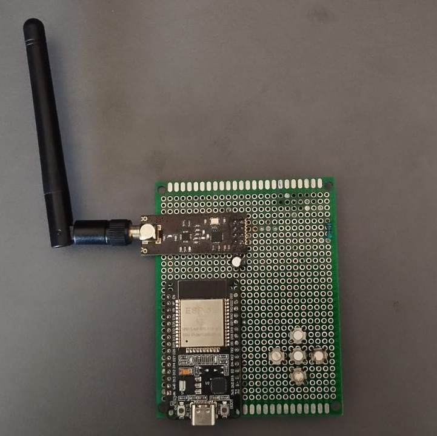

# nRF-SpectrumAnalyzer

[](https://doi.org/10.5281/zenodo.20783176)
[](LICENSE)

A low-cost dual-node 2.4 GHz ISM band occupancy monitoring and interference characterization platform built using commodity embedded hardware.

This repository accompanies the research manuscript:

> **Dual-node 2.4 GHz ISM Band Interference Testbed Using Commodity Embedded Hardware: Characterisation of Generation and Detection Boundaries**

---

# Overview

The project investigates the practical limits of interference generation and occupancy-based detection within the 2.4 GHz ISM band using inexpensive embedded hardware.

The platform consists of:

* A monitoring node based on Arduino Uno and NRF24L01+
* An interference-generation node based on ESP32 and NRF24L01+
* A statistical occupancy-monitoring framework
* Data acquisition and analysis workflows used for the accompanying research study

---

# Research Artifact

This repository serves as:

* Research software archive
* Experimental implementation reference
* Reproducibility resource
* Dataset archive
* Educational RF monitoring platform

The archived release associated with the manuscript contains the detector firmware version used to generate the reported experimental results.

---

# System Architecture


*Figure 1. High-level architecture of the dual-node experimental platform.*

---

# Detection Logic


*Figure 2. Channel occupancy measurement and interference detection workflow.*

---

# Experimental Platform

## Monitoring Node

Hardware:

* Arduino Uno
* NRF24L01+ PA/LNA
* External antenna

Functions:

* Multi-channel scanning
* Occupancy estimation
* Alert generation
* Data logging

---

## Interference Node

Hardware:

* ESP32 DevKit V1
* NRF24L01+ PA/LNA modules

Functions:

* Controlled interference generation
* Experimental validation support

---

# Hardware Documentation

## Monitoring Node


---

## Interference Node



---

## Pin Mapping & Wiring Diagram

[Pinmap and wiring](/docs/Manual.md)

---

# Repository Structure

```text
nRF-SpectrumAnalyzer/

├── firmware/
├── datasets/
├── analysis/
├── docs/
├── CHANGELOG.md
├── CITATION.cff
├── LICENSE
└── README.md
```

---

# Reproducing the Published Results

The experimental results reported in the accompanying manuscript were generated using:

```text
Firmware Version: v3.1.0
```

General workflow:

1. Assemble hardware according to documentation.
2. Flash detector firmware.
3. Collect occupancy measurements.
4. Export measurements as CSV.
5. Execute analysis scripts.
6. Compare generated figures with manuscript figures.

---

# Data Availability

Experimental datasets used in the manuscript are archived within this repository and the associated DOI release.

Datasets include:

* Baseline occupancy measurements
* Bluetooth interference measurements
* BLE interference measurements
* Wi-Fi interference measurements
* Combined interference measurements

---

# Code Availability

The following components are publicly available:

* Detector firmware
* Analysis scripts
* Documentation
* Experimental datasets

The interference-generation firmware is not included in the public release because it can be adapted for intentional radio-frequency interference generation.

Excluding this component reduces the potential for misuse while preserving reproducibility through the provided datasets, detector implementation, experimental methodology, and analysis scripts.

---

# Citation

If you use this repository, please cite the archived release.

Citation metadata is available through:

* CITATION.cff
* Zenodo DOI
* Associated manuscript

Example:

```bibtex
@software{harishkumar_nrf_spectrumanalyzer,
  author = {Harishkumar, Aris},
  title = {nRF-SpectrumAnalyzer},
  year = {2026},
  doi = {DOI_HERE}
}
```

---

# License

GPL-3.0

See LICENSE for details.

---

# Disclaimer

This repository is intended for:

* Academic research
* Wireless coexistence studies
* RF occupancy monitoring
* Educational purposes

Users are responsible for ensuring compliance with all applicable radio-frequency regulations and local laws governing wireless transmissions.

---

# Related Publication

Dual-node 2.4 GHz ISM Band Interference Testbed Using Commodity Embedded Hardware: Characterisation of Generation and Detection Boundaries.

Manuscript and supplementary material are available in the DOI archive associated with this repository.
